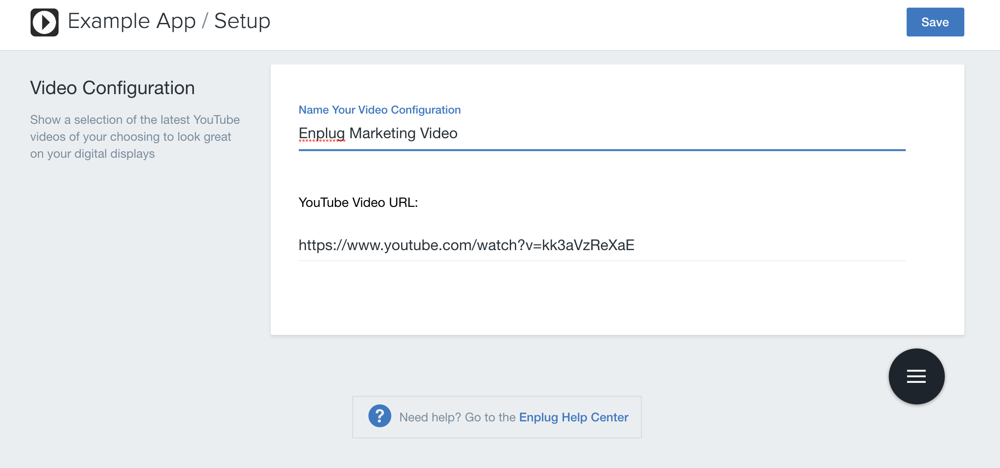
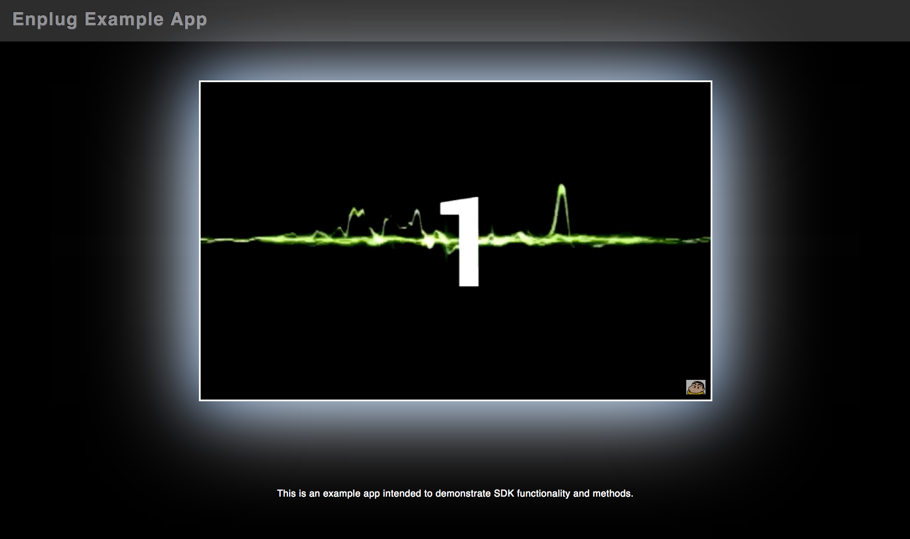

# app-seed - the seed for DisplayOS apps
This project is an application skeleton for a typical DisplayOS web-based app. You can use it to quickly bootstrap your DisplayOS webapp projects and dev environment for these projects.
# Enplug - Example App

Learn more about building apps through our SDK: https://developers.enplug.com/

## Getting Started
To get you started, you can simply clone the example-app repository and install the dependencies with `npm install`.

```
git clone https://github.com/enplug/example-app.git
```

### Install Dependencies
We have moved to an entirely NPM managed dependency system. The devDependencies are the tools used to build the app (like [webpack](https://webpack.github.io/)) and the regular dependencies are everything you need to run the app in your browser (like the [dashboard-sdk](https://github.com/Enplug/dashboard-sdk)).
- Everything is installed via `npm`, the [node package manager](https://www.npmjs.org/). NPM scripts are used to perform the build operations listed below as well.

### Set up Amazon S3 credentials
If you'll be deploying your app on S3, you need to add an aws.private.json file containing your credentials in this format:
```
{
    "accessKeyId": "<your-aws-access-key-id>",
    "secretAccessKey": "<your-aws-secret-access-key>"
}
```
If you won't be using S3, you can remove the `grunt/aws.js` task.

### Build Setup
As shown in this app, we are using `Webpack` as a build and development tool. There are two configuration files, one for the dashboard part of your project, and one for the display/player portion of the project.  

When the application is built it will be in the dist/ directory. You can point a local web server to the dist/ directory if you want to preview the production build locally.

### Scripts
There are only a few commands that you will need to use:

`npm install`: installs application dependencies.  

`npm run build`: builds a production version of the project placing it in the dist/directory. It allows you to chose between the dashboard or app portion of the application to build.

`npm run dev`: this is for development. It will first build then spin up a webpack-dev-server and enable hot module reloading.  

`npm run release`: this is for deploying your project. If you choose to deploy to S3, you will need to do additional configuration to the package.json and script to match your credentials/bucket information.

## Dashboard SDK

[Dashboard SDK - Github](https://github.com/Enplug/dashboard-sdk)

The Dashboard SDK is used to create the interface for saving, editing and deploying different content to your display. For the dashboard application of this app, we are passing in `$enplugDashboard` and `$enplugAccount` as dependencies, both of which are provided through the SDK.

We use `$enplugDashboard` to interact and modify the dashboard display. For example, adding a header button for saving.

Additionally, we use `$enplugAccount` to store various types of data and properties we might need when displaying content for our youtube videos, like a video url.

The data we store is encapsulated in an `asset` object using the `$enplugAccount.saveAsset()` endpoint. For example, in this app we are storing an asset object with the following properties:

```js
{
  Id: 123456789,
  Value: {
      title: "This is Enplug - YouTube Video",
      url: "https://www.youtube.com/watch?v=kk3aVzReXaE"
  },
  VenueIds: []
}
```

## Player SDK


[Player SDK - Github](https://github.com/Enplug/js-player-sdk)

In the Player SDK, we are using the [YouTube API](https://developers.google.com/youtube/iframe_api_reference) and [youtube-player](https://www.npmjs.com/package/youtube-player) `npm` dependency to display different YouTube videos on screen. We are able to use the Player SDK methods to effectively show the player on screen, grab our asset data, then load the respective video onscreen.

We use several different methods in our player application including `enplug.appStatus.start()` which tells the player it's ready to be rendered, and `enplug.appStatus.hide()` to let the server know when our video is done playing.

For more information about these SDK methods, please feel free to take a look at our API documentation: https://developers.enplug.com/api-reference/.
